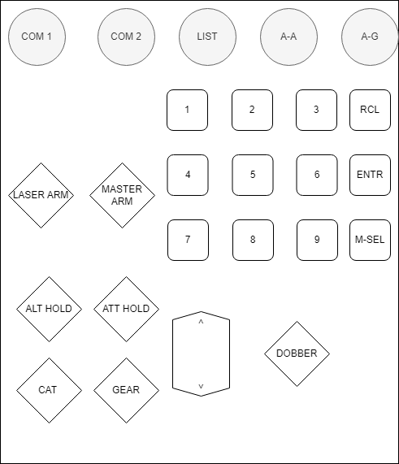

# F-16 ICP Button Box

# Summary

This project seeks to document my progress on building a F-16 ICP (Integrated Control Panel) for use in DCS. 

 
My approach relies on using 3 arduino pro micro boards connected via their ic2 allowing for only 1 usb for output rather than 3. There is an oppertunity to use a board with more GPIO like a bluepill board however, with my limited electrical engineering ability it was easier to just use the arduinos.

# Diagram

  
A decision was made early on to use solder to connected any switches rather than using any connectors mainly as I wanted to use this as a learning oppertunity but also to avoid any connections coming loose overtime.

# Requirements
## Tools 
- Soldering Iron
- Solder
- Something to cut plastic

## Hardware
- 4 SPST Switches
- 2 DPST Switches
- 1 Rocker Switch
- 12 Cherry MX Switches
- 9 Momentary Push Buttons
- Project Box
- 3 Ardunio Pro Micro's

# Plan
Below can be seen a rough plan I made using draw.io

# Steps

To begin after creating the plan I began dissasembling an old keyboard I had to salvage the cherry MX switches, this involved using a desoldering pump to remove any solder.
