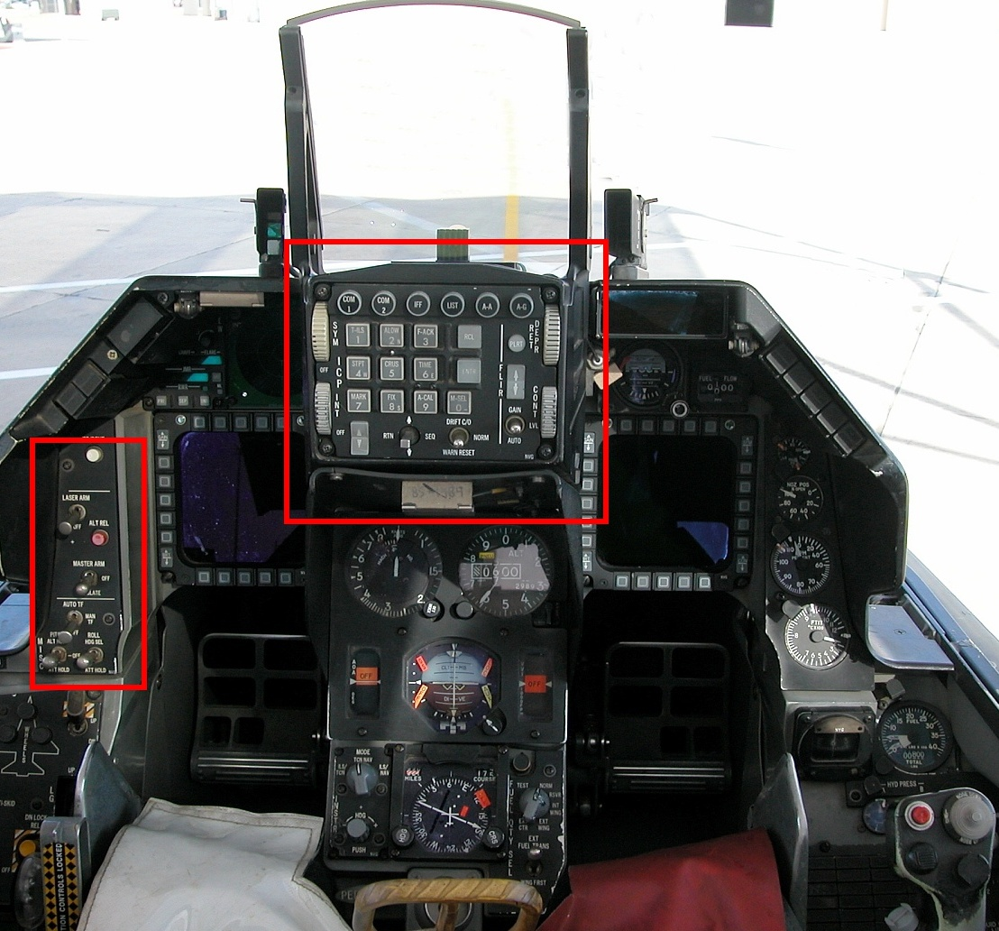
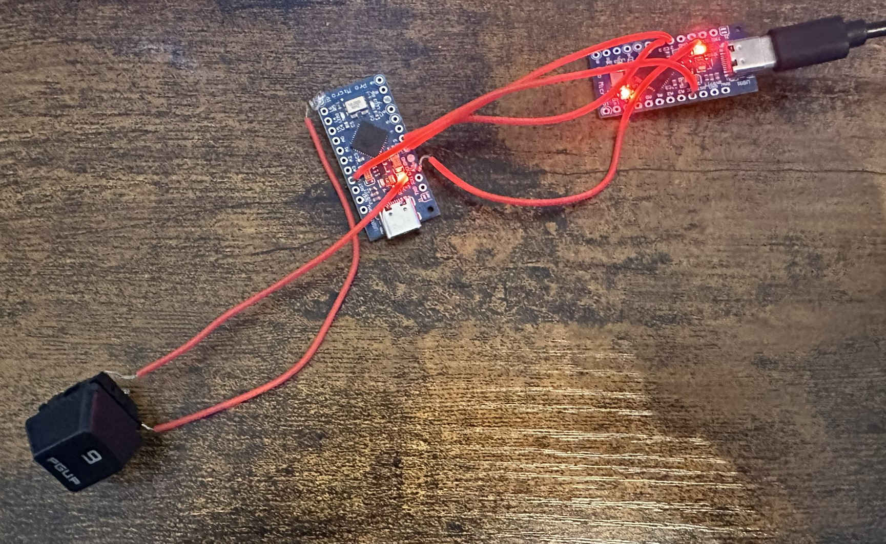
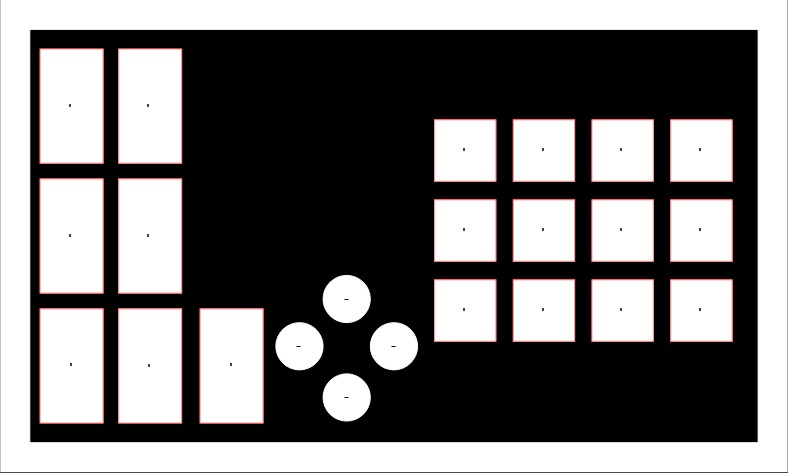
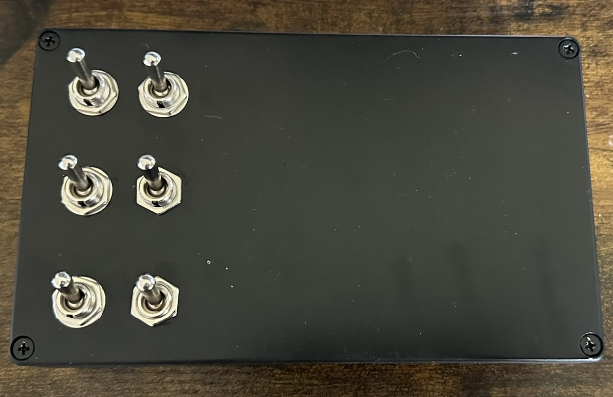

# F-16 ICP Button Box

# Summary

This project seeks to document my progress on building a F-16 ICP (Integrated Control Panel) along with some functionality from the Misc Armament Panel for use in DCS.
 

 
My approach relies on using 3 arduino pro micro boards connected via their i2c allowing for only 1 usb for output rather than 3. There is an oppertunity to use a board with more GPIO like a bluepill board or use a GPIO expander like the mpc23017 however, with my limited electrical engineering ability it was easier to just use the arduinos.

 

A decision was made early on to use solder to connect any switches rather than using any connectors mainly as I wanted to use this as a learning oppertunity but also to avoid any connections coming loose overtime.

 

# Diagram

# Requirements / BOM

## Tools

- Soldering Iron
- Solder
- Something to cut plastic

## Hardware

- 4 SPST Switches
- 2 DPST Switches
- 1 Rocker Switch
- 12 Cherry MX Switches
- 9 Momentary Push Buttons
- Project Box
- 3 Ardunio Pro Micro's

 

# Steps

## Dissasembly

To begin after creating the plan I began disassembling an old keyboard I had to salvage the cherry MX switches, this involved using a desoldering pump to remove any solder.
 

To begin actually wiring up the icp I initially wired up the 3 arduinos via to take advantage of the i2c protocol by wiring the SDA, SCL, VCC and Ground pins.
After this ran some code to verify the boards were communicating with one another using a button to test if the master board was correctly reading the inputs from the slave board.

 
The code being used to power the ICP is taken from Matthew Heironimus and his work on the ardunio joystick library which I have modified to work with the i2c protocol and 2 other arduios being used as slaves.

## Construction
Before construction began the initial design had to change, if a box was mounted vertically it would likely prevent me from seeing the bottom of the monitor behind it, for this reason the box was changed so that it would now sit horizontally and a few buttons had to be removed due to the internal constuction of the box having less area that the outside.

### Re-Design

To begin construction on the ICP the project box was used as the shell of the ICP, initially the SPST and DPST switches were installed as unlike the cherry keys they can be mounted straight into a 12mm circular hole which was cut with a step bit which reduced any melting and provided cleaner cuts.

The same was repeated for the momentary switches, however, the cherry keys proved to be alot more difficult. The best method I found for install the cherry keys into the box was to begin with drilling out tiny holes in the shape of the key and then melt the plastic out with the soldering iron. The cuts produced by this were far from clean however It was the only method I had available wihtout additional tooling.

## Wiring

I began with wiring the SPST and DPST switches first, these were just screwed onto the terminals of the switches and were soldered to the digital pins on the arudino, there was alot of experimenting and testing with this as the initial code proved to be buggy and my soldering was bad enough to cross digital pins.

After this the momentary switches had to be wired, since most of the pins on the first ardunio were now taken up by the SPST and DPST. There were fairly simple to solder and by this point my soldering skills had improved enough however this highlighted to me that the code I had previously written for both the master and slave board didn't work, it created ghost inputs and wasn't recognising button presses so a rewrite was in order.

